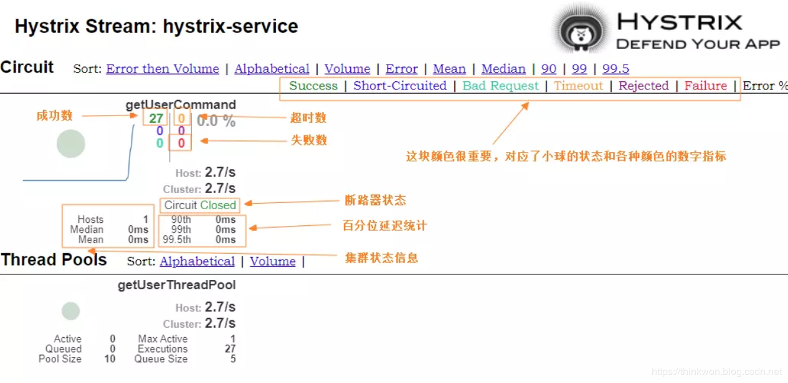

# Hystrix Dashboard 图表解读
> 图表解读如下，需要注意的是，小球代表该实例健康状态及流量情况，颜色越显眼，表示实例越不健康，小球越大，表示实例流量越大。曲线表示Hystrix实例的实时流量变化。

## Hystrix 集群实例监控
> 这里我们使用Turbine来聚合hystrix-service服务的监控信息，然后我们的hystrix-dashboard服务就可以从Turbine获取聚合好的监控信息展示给我们了。