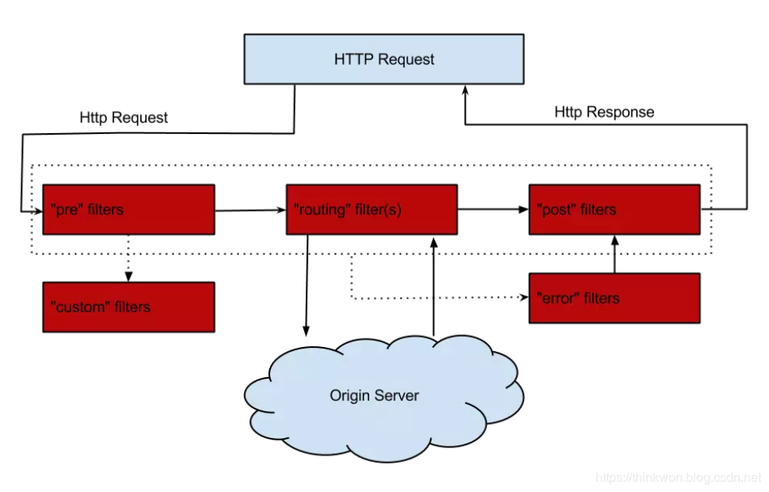

## 过滤器
> 路由与过滤是Zuul的两大核心功能，路由功能负责将外部请求转发到具体的服务实例上去，是实现统一访问入口的基础，过滤功能负责对请求过程进行额外的处理，是请求校验过滤及服务聚合的基础。

### 过滤器类型
> Zuul中有以下几种典型的过滤器类型。
* pre：在请求被路由到目标服务前执行，比如权限校验、打印日志等功能；
* routing：在请求被路由到目标服务时执行，这是使用Apache HttpClient或Netflix Ribbon构建和发送原始HTTP请求的地方；
* post：在请求被路由到目标服务后执行，比如给目标服务的响应添加头信息，收集统计数据等功能；
* error：请求在其他阶段发生错误时执行。

### 过滤器的生命周期
> 下图描述了一个HTTP请求到达API网关后，如何在各种不同类型的过滤器中流转的过程。




### 核心过滤器

| 过滤器名称                   | 过滤类型  | 优先级  | 过滤器的作用                                                                                             |
| ----------------------- | ----- | ---- | -------------------------------------------------------------------------------------------------- |
| ServletDetectionFilter  | pre   | -3   | 检测当前请求是通过DispatcherServlet处理运行的还是ZuulServlet运行处理的。                                                 |
| Servlet30WrapperFilter  | pre   | -2   | 对原始的HttpServletRequest进行包装。                                                                        |
| FormBodyWrapperFilter   | pre   | -1   | 将Content-Type为application/x-www-form-urlencoded或multipart/form-data的请求包装成FormBodyRequestWrapper对象。 |
| DebugFilter             | route | 1    | 根据zuul.debug.request的配置来决定是否打印debug日志。                                                             |
| PreDecorationFilter     | route | 5    | 对当前请求进行预处理以便执行后续操作。                                                                                |
| RibbonRoutingFilter     | route | 10   | 通过Ribbon和Hystrix来向服务实例发起请求，并将请求结果进行返回。                                                             |
| SimpleHostRoutingFilter | route | 100  | 只对请求上下文中有routeHost参数的进行处理，直接使用HttpClient向routeHost对应的物理地址进行转发。                                     |
| SendForwardFilter       | route | 500  | 只对请求上下文中有forward.to参数的进行处理，进行本地跳转。                                                                 |
| SendErrorFilter         | post  | 0    | 当其他过滤器内部发生异常时的会由它来进行处理，产生错误响应。                                                                     |
| SendResponseFilter      | post  | 1000 | 利用请求上下文的响应信息来组织请求成功的响应内容。|

### 禁用过滤器  

> 我们可以对过滤器进行禁用的配置，配置格式如下：

```yaml
zuul:
  filterClassName:
    filter:
      disable: true 
```  
以下是禁用PreLogFilter的示例配置：  

```yaml
zuul:
  PreLogFilter:
    pre:
      disable: true 
```                          

### Ribbon和Hystrix的支持
> 由于Zuul自动集成了Ribbon和Hystrix，所以Zuul天生就有负载均衡和服务容错能力，我们可以通过Ribbon和Hystrix的配置来配置Zuul中的相应功能。

### 常用配置
```yaml
zuul:
  routes: #给服务配置路由
    user-service:
      path: /userService/**
    feign-service:
      path: /feignService/**
  ignored-services: user-service,feign-service #关闭默认路由配置
  prefix: /proxy #给网关路由添加前缀
  sensitive-headers: Cookie,Set-Cookie,Authorization #配置过滤敏感的请求头信息，设置为空就不会过滤
  add-host-header: true #设置为true重定向是会添加host请求头
  retryable: true # 关闭重试机制
  PreLogFilter:
    pre:
      disable: false #控制是否启用过滤器

```


